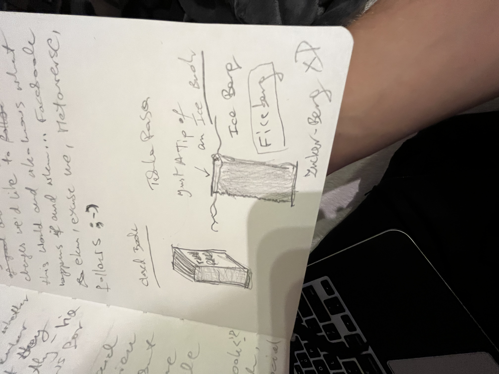

# What If The Like Button Went Away

What if the like button went away.

What if we only had emojis that express how we feel about the content being shared and **not** how high (or low) we rate it.

What if the one who shares the content could choose who they want to see the reactions from, if from anyone at all.

What if we even couldn't know, whether the person we're reacting to knows how we feel about the content she shares?

Unless they ask directly. Via the chanel of the sharer's choosing, if any.

What if we don't allow emojis at all and only give the option to express the feelings in words. In writing or in speech.

What if we "unFacebook" or "close the Book".

Start from Scratch.

From the opposite end of the social spectrum.

The Digital Social Spectrum.

Because some (a lot) of us can (want) not really escape it completely. At least not immediately (one small step at a time).

And let's make the notifications opt-in, for the God of Love ❤️

And what if we wouldn't hate on Facebook but just let ourselves try something different, be a part and an example of the good change we would like to see in This World (or The Next One 😏).

And who knows what happens if and when... Facebook, ekhm, Metaverse, follows.

Metametaverse? 🤔

# Ficeberg

# "Jakby nie stało się nic" by Tomek Lipiński

